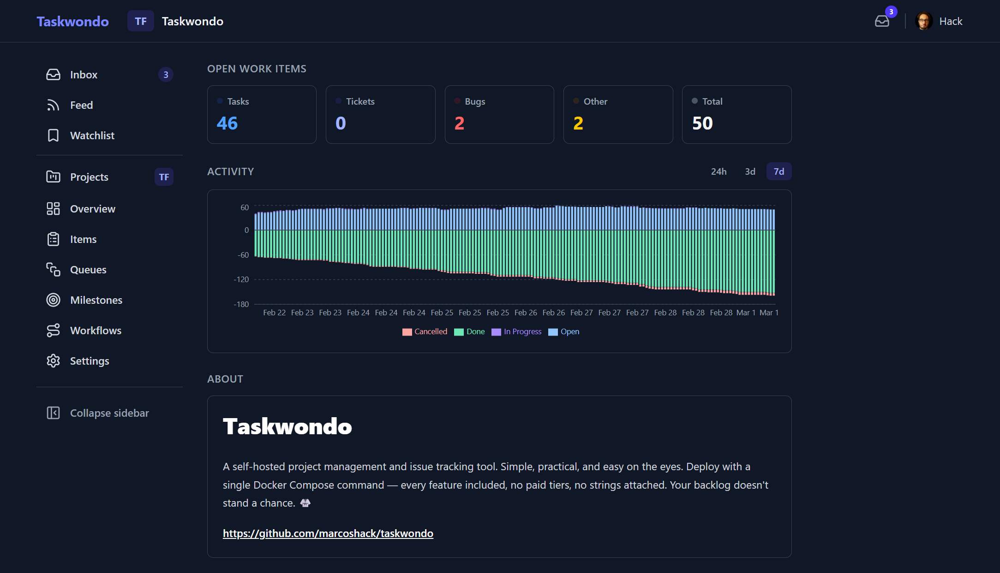
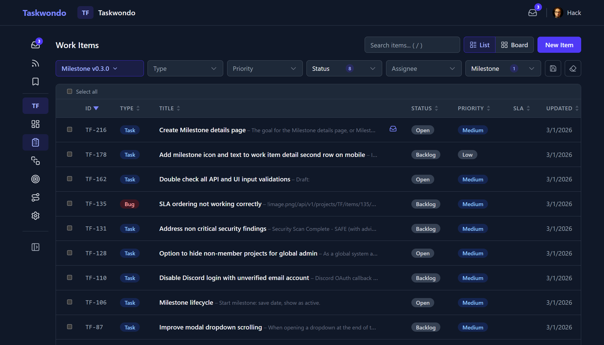

# Taskwondo — Self-Hosted Task & Project Management [](https://github.com/marcoshack/taskwondo/actions/workflows/ci.yml)

A self-hosted, open-source project management and issue tracking platform. Kanban boards, customizable workflows, milestones, file attachments, SLA tracking, and 9 languages — all included out of the box. Deploy with a single Docker Compose command. No paid tiers, no strings attached. Your backlog doesn't stand a chance! 🥋

## Screenshots





See [more screenshots](docs/overview.md) for a full walkthrough of features.

## Features

- **Projects** with role-based membership (owner, admin, member) and unique keys (e.g. `PROJ`)
- **Work items** — tasks, bugs, tickets, feedback, and epics with per-project sequential numbering (`PROJ-1`, `PROJ-2`)
- **Kanban board** with drag-and-drop status changes, or list view with sortable columns
- **Customizable workflows** — define statuses, transitions, and per-type workflow mappings
- **Milestones** with progress tracking and due dates
- **Queues** for organizing incoming work (support, alerts, feedback)
- **Comments** with markdown, edit history, and paste-to-upload images
- **Relations** — blocks, relates to, duplicates — with cross-project support
- **File attachments** with preview modal and inline images
- **Full-text search** across titles and descriptions
- **SLA tracking** with business hours, timezone support, and deadline indicators
- **Activity timeline** with field change diffs
- **API keys** (`twk_` prefix) for programmatic access
- **9 languages** — English, Portuguese, Spanish, French, German, Japanese, Chinese, Korean, Arabic (RTL)
- **Dark mode**, configurable font size, keyboard shortcuts, responsive mobile layout
- **Data export/import** for backup and restore

## Tech Stack

| Component | Technology |
|-----------|------------|
| API | Go (chi router) |
| Database | PostgreSQL 16 |
| Frontend | React + TypeScript + Vite + Tailwind CSS |
| Storage | S3-compatible (MinIO included) |
| Events | NATS JetStream |
| Auth | JWT + API keys, optional OAuth (Discord, Google, GitHub, Microsoft) |
| Deployment | Docker Compose (5 containers) |

## Quick Start

```bash
git clone https://github.com/marcoshack/taskwondo.git
cd taskwondo
./install.sh --docker    # generates .env, pulls images, starts services
```

Then open [http://localhost:3000](http://localhost:3000) and log in with the admin credentials printed by the installer.

To start Taskwondo automatically on boot, install the included systemd service:

```bash
sudo cp docker/taskwondo.service /etc/systemd/system/
sudo sed -i "s|/path/to/your/taskwondo|$(pwd)|" /etc/systemd/system/taskwondo.service
sudo systemctl daemon-reload
sudo systemctl enable --now taskwondo
```

For manual installation without Docker, see [MANUAL_INSTALL.md](MANUAL_INSTALL.md).

## Development

Requires Go 1.25+, Node.js 22+, Docker.

```bash
./install.sh --manual-setup -y # generate .env with secrets and defaults
make setup                     # configure git hooks
make dev                       # starts Postgres + MinIO + API (hot-reload) + Vite dev server
```

Run tests:

```bash
make test                      # Go tests + frontend build
make test-e2e                  # Playwright E2E tests (fully containerized)
```

See [AGENTS.md](AGENTS.md) for full architecture notes and conventions.

## License

MIT
