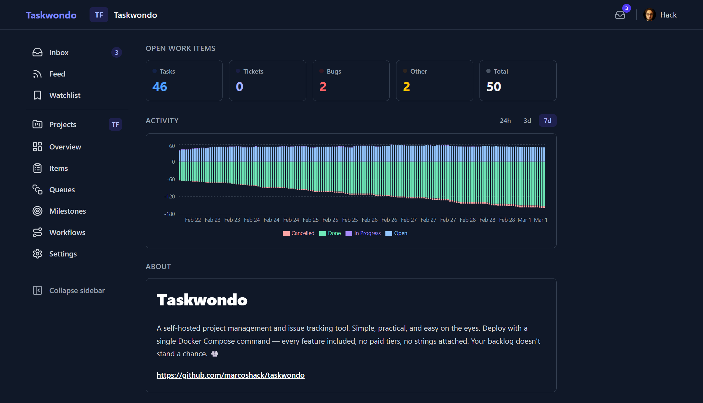
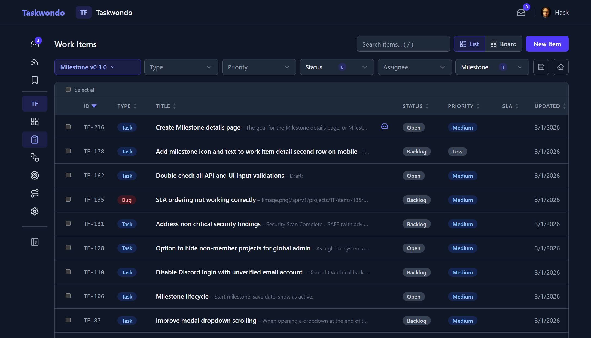
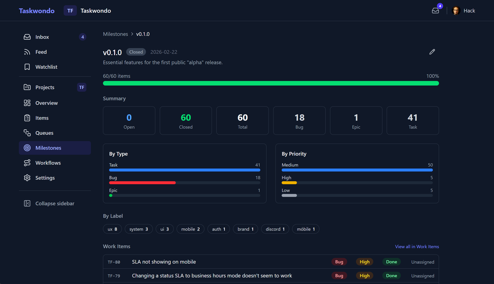
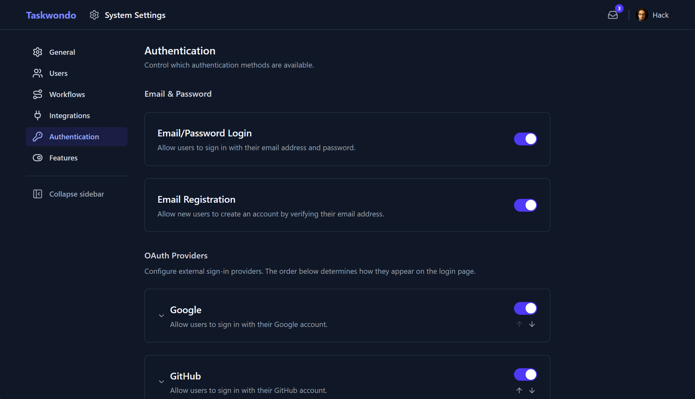
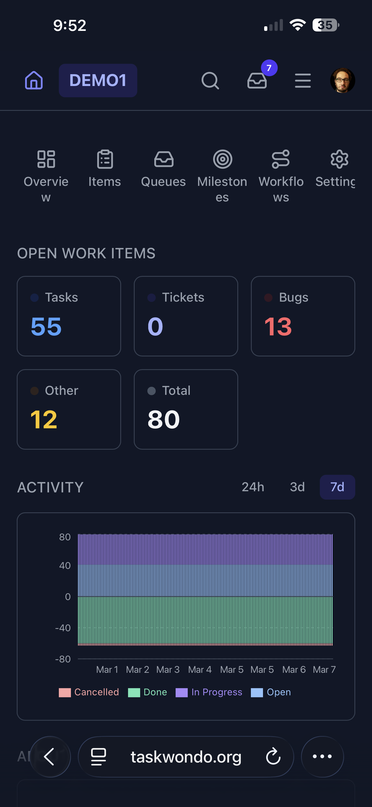
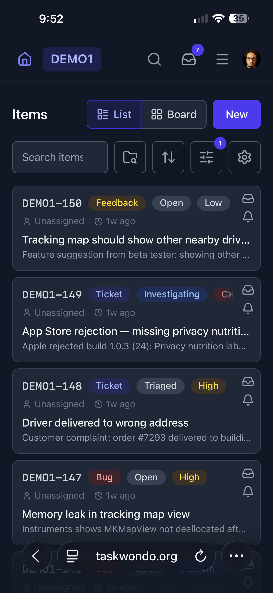
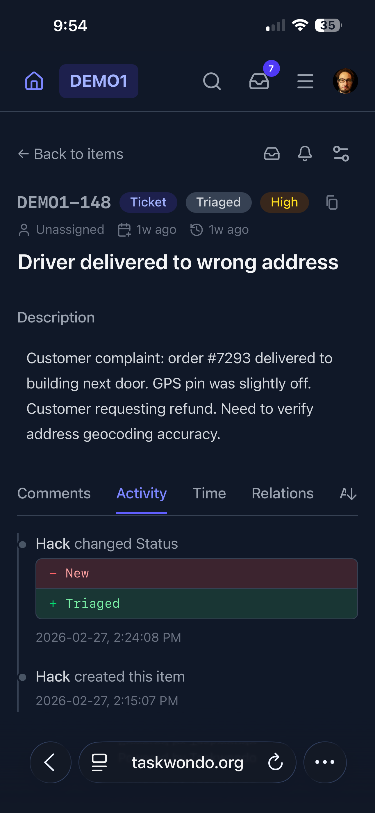
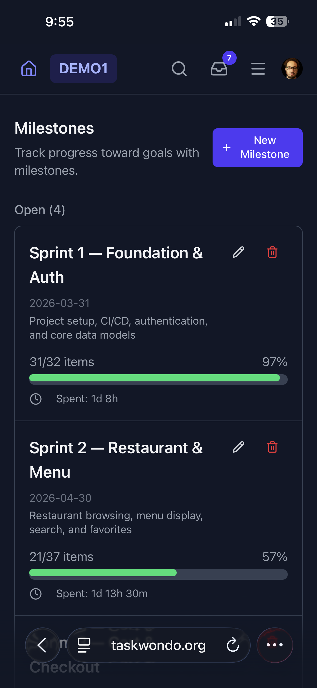
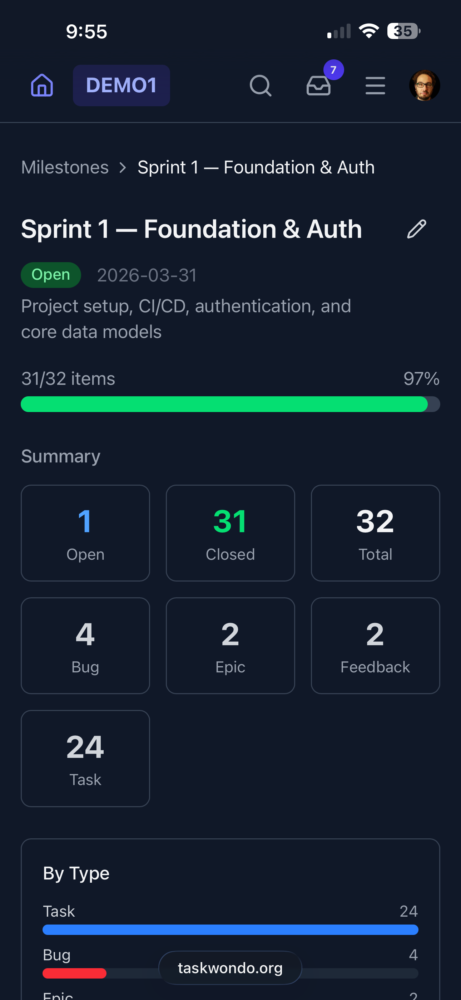
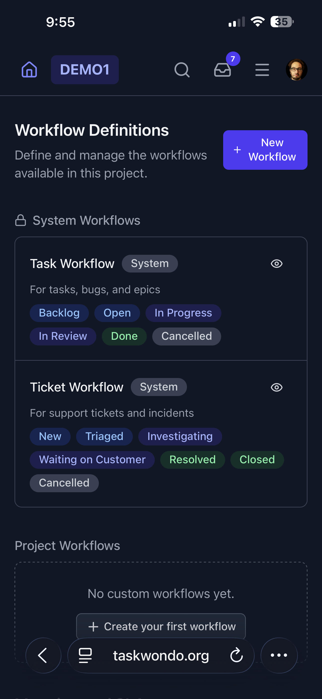

# Taskwondo — Self-Hosted Task & Project Management [](https://github.com/marcoshack/taskwondo/actions/workflows/ci.yml)

A self-hosted, open-source project management and issue tracking platform. Namespaces, kanban boards, customizable workflows, semantic search, email notifications, AI integration via MCP, and 9 languages — all included out of the box. Deploy with a single Docker Compose command. No paid tiers, no strings attached. Your backlog doesn't stand a chance! 🥋

Try it out at https://taskwondo.org/

Join our Discord server: https://discord.gg/mUAag4CtBH

## Screenshots

<p align="center">
  
  
  
  
</p>


<p align="center">
  
  
  
  
  
  
</p>

See [more screenshots](docs/overview.md) for a full walkthrough of features.

## Features

### Projects & Organization

- **Namespaces** for multi-tenant workspaces with icons, colors, and role-based membership
- **Projects** with role-based membership (owner, admin, member) and unique keys (e.g. `PROJ`)
- **Milestones** with progress tracking, due dates, and stats dashboard
- **Queues** for organizing incoming work (support, alerts, feedback)

### Work Items

- **Tasks, bugs, tickets, feedback, and epics** with per-project sequential numbering (`PROJ-1`, `PROJ-2`)
- **Parent/child hierarchy** with child progress tracking
- **Complexity estimation** (story points) with per-project configurable values
- **Time tracking** with descriptions per entry

### Views & Search

- **Kanban board** with drag-and-drop status changes, or list view with sortable columns
- **Command palette** (Cmd/Ctrl+K) — jump to any page, project or namespace, plus search with semantic search (pgvector + Ollama) and full-text fallback
- **Personal Inbox** with reordering, project filter, and auto-refresh
- **Watchlist** page for tracked items with list and board views
- **Milestone dashboard** with status breakdown and progress visualization
- **Activity timeline** with field change diffs
- **Activity graph** with custom time range selector

### Collaboration

- **Comments** with markdown, edit history, and paste-to-upload images
- **@ mentions** for referencing projects and work items
- **Relations** — blocks, relates to, duplicates — with cross-project support
- **Watchers** with change notifications
- **Email notifications** in the user's preferred language
- **Email-based project invites** with invite codes

### Files & Content

- **File attachments** with preview modal and inline images
- **Copy as Markdown** for work item summaries
- **Data export/import** for backup and restore

### Workflows

- **Customizable workflows** — define statuses, transitions, and per-type workflow mappings
- **SLA tracking** with business hours, timezone support, and deadline indicators

### Authentication & Security

- **JWT + API keys** (`twk_` prefix) for programmatic access
- **OAuth login** — Discord, Google, GitHub, Microsoft
- **System API keys** with per-resource permissions and expiration
- **Email verification** with invite code support
- **Rate limiting** on authentication endpoints

### Integrations & Monitoring

- **MCP server** (50+ tools) for AI/LLM integration
- **Prometheus metrics** endpoint with resource count gauges

### Customization & UI

- **9 languages** — English, Portuguese, Spanish, French, German, Japanese, Chinese, Korean, Arabic (RTL)
- **Dark mode**, configurable font size, expanded/centered layout modes
- **Configurable brand name** in system settings
- **Keyboard shortcuts**, responsive mobile layout

## Tech Stack

| Component | Technology |
|-----------|------------|
| API | Go (chi router) |
| Database | PostgreSQL 16 |
| Frontend | React + TypeScript + Vite + Tailwind CSS |
| Storage | S3-compatible (MinIO included) |
| Events | NATS JetStream |
| Auth | JWT + API keys, optional OAuth (Discord, Google, GitHub, Microsoft) |
| Deployment | Docker Compose (5 containers) |

## Quick Start

```bash
git clone https://github.com/marcoshack/taskwondo.git
cd taskwondo
./install.sh --docker    # generates .env, pulls images, starts services
```

Then open [http://localhost:3000](http://localhost:3000) and log in with the admin credentials printed by the installer.

To start Taskwondo automatically on boot, install the included systemd service:

```bash
sudo cp docker/taskwondo.service /etc/systemd/system/
sudo sed -i "s|/path/to/your/taskwondo|$(pwd)|" /etc/systemd/system/taskwondo.service
sudo systemctl daemon-reload
sudo systemctl enable --now taskwondo
```

For manual installation without Docker, see [MANUAL_INSTALL.md](MANUAL_INSTALL.md).

## MCP Server

Taskwondo includes an [MCP server](https://modelcontextprotocol.io/) with 50+ tools for AI/LLM integration — manage work items, comments, relations, attachments, time entries, inbox, milestones, and more from any MCP-compatible client.

**Downloads** — available on the [Releases](https://github.com/marcoshack/taskwondo/releases) page:

- `taskwondo-mcp-linux-amd64` — MCP server binary (Linux/amd64)
- `taskwondo-mcp-darwin-arm64` — MCP server binary (macOS/arm64, Apple Silicon)
- `taskwondo-mcp-windows-amd64.exe` — MCP server binary (Windows/amd64)
- `taskwondo.mcpb` — MCP bundle for [Claude Desktop](https://claude.ai/download) (Windows + macOS)

The MCP server connects to a running Taskwondo instance via API key. Set the `TASKWONDO_URL` and `TASKWONDO_API_KEY` environment variables, then run the binary as a stdio transport.

### Configuring Claude Code

After downloading the MCP binary for your platform (e.g. `taskwondo-mcp-darwin-arm64` on Apple Silicon), make it executable and register it with Claude Code at user scope so it's available across all your projects:

```bash
# 1. Move the binary somewhere on your PATH and make it executable
chmod +x ~/Downloads/taskwondo-mcp-darwin-arm64
mv ~/Downloads/taskwondo-mcp-darwin-arm64 /usr/local/bin/taskwondo-mcp

# 2. Generate an API key from Taskwondo: User Menu → Preferences → Authentication → API Keys

# 3. Register the server with Claude Code at user scope
claude mcp add taskwondo \
  --scope user \
  --env TASKWONDO_URL=https://your-instance.example.com \
  --env TASKWONDO_API_KEY=twk_your_api_key_here \
  -- taskwondo-mcp
```

Verify the server is registered and reachable:

```bash
claude mcp list
```

For Claude Desktop, download the `taskwondo.mcpb` bundle from the [Releases](https://github.com/marcoshack/taskwondo/releases) page and open it — Claude Desktop will prompt for the URL and API key during install.

## Development

See [README_DEV.md](README_DEV.md) for development setup instructions (Docker, Colima on macOS, running tests, etc.).

## License

MIT
